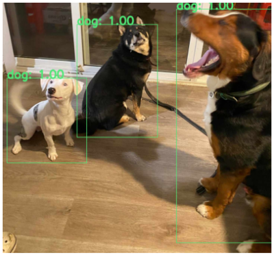
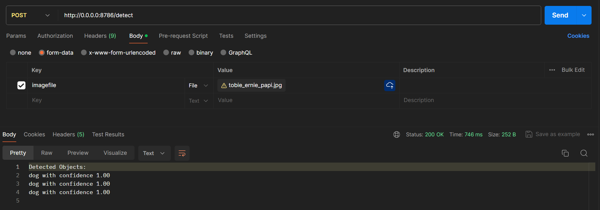

# CV BASIC: Object Detection

This project implements an object detection service using a YOLOv3 model. It can detect objects in images using a pre-trained model and provide detected object information through a Flask-based web service. The service accepts images, processes them to detect objects, and returns the detected objects along with their confidence scores.

### Project Structure
`GraphicDataProcessing.py`: Contains the class and functions used for object detection.
`objectDetectionService.py`: Flask application for web service
`ObjectDetection.ipynb`:  Jupyter notebook assignment
`tutorial.ipnyb`: Object detection tutorial
`coco.names`: Object labels
`requirements`: Contains required libraries
`Dockerfile`: Docker configuration
`Pictures`: Contains the images used
___

### CREATING DOCKER IMAGE
```
docker buildx build -t ""<docker_user_name>/705.603:cvbasicsAssignment_1" --platform linux/amd64,linux/arm64 --push .
```

### LOCAL TESTING
```
docker run -v <host directory>:/output ccarino/705.603:cvbasicsAssignment_1
```

### SETTING UP POSTMAN



1. Send **POST** request to: http://0.0.0.0:8786/detect
2. Select **Body**, then **form-data**
3. Type **imagefile** under **Key** and select **File**
4. Upload your image under **Value**
5. Hit **Send**


