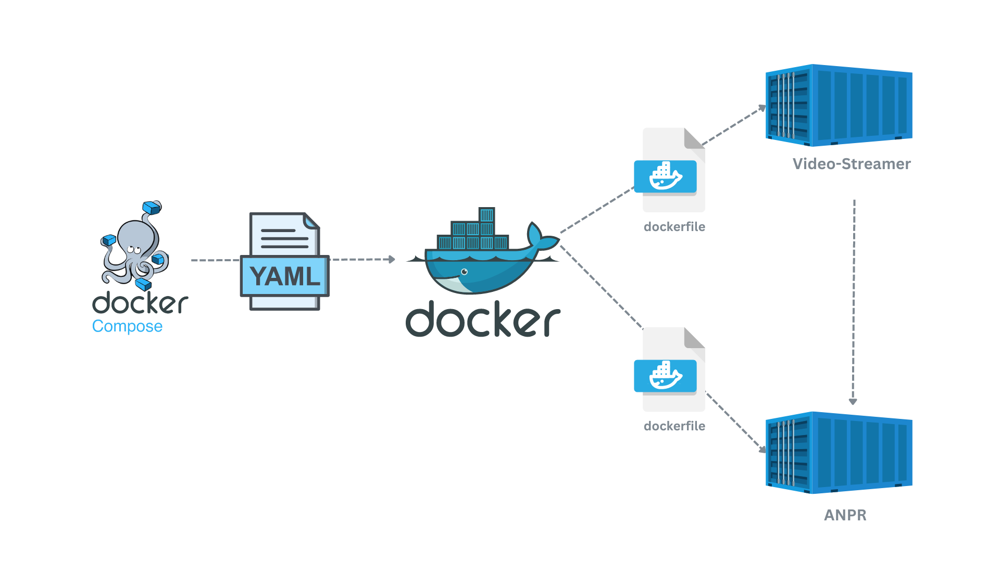
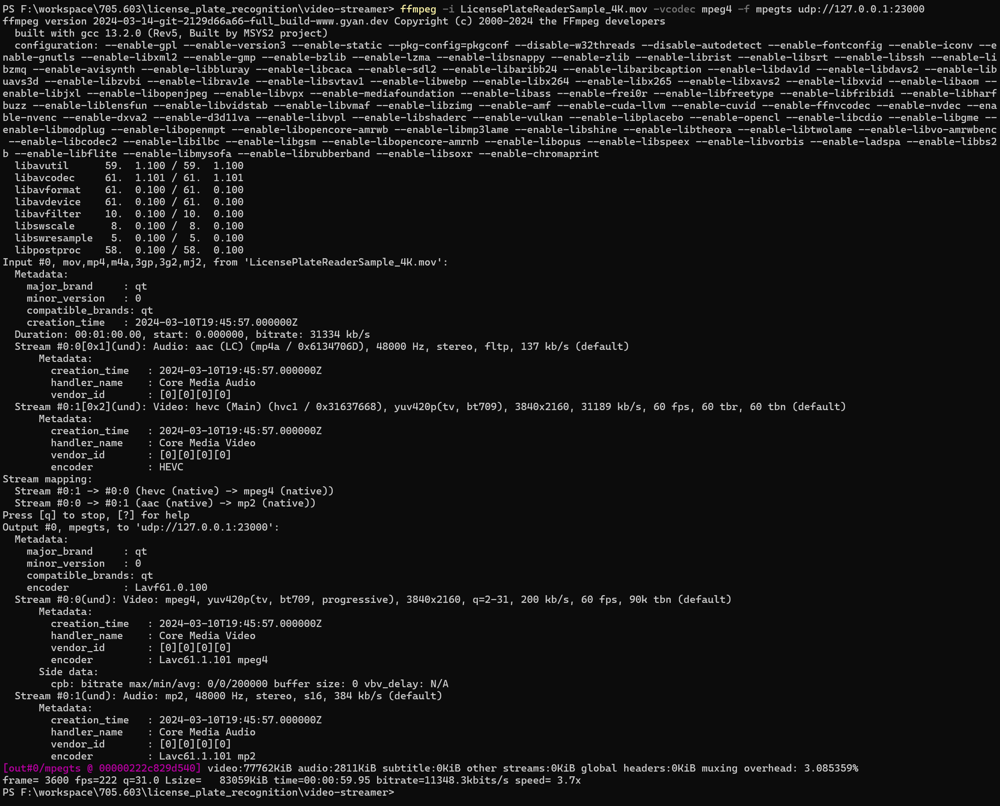
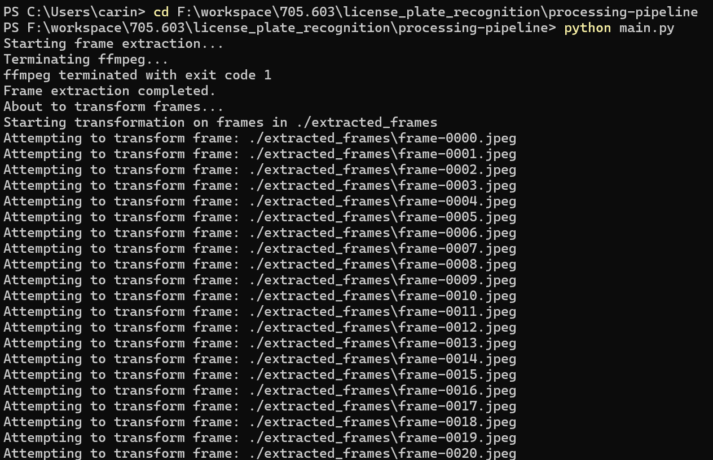
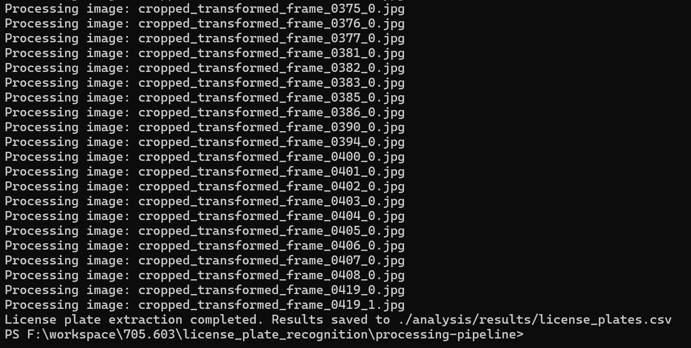
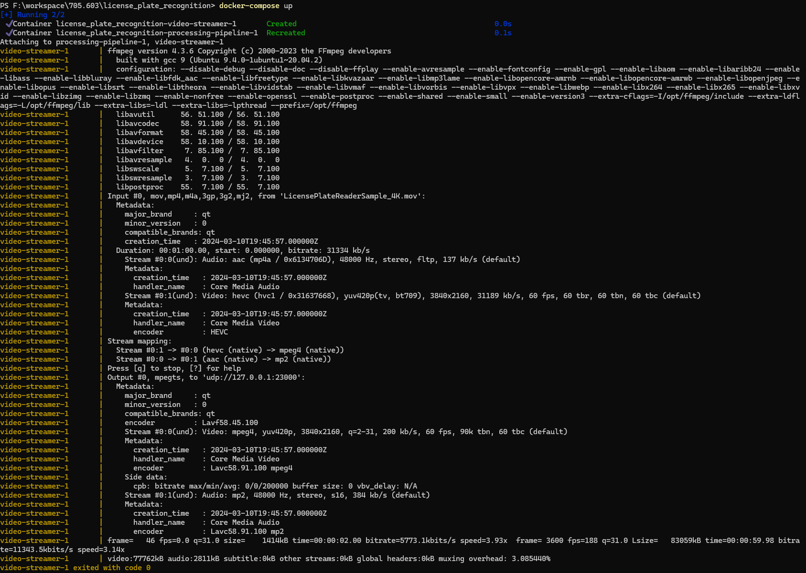
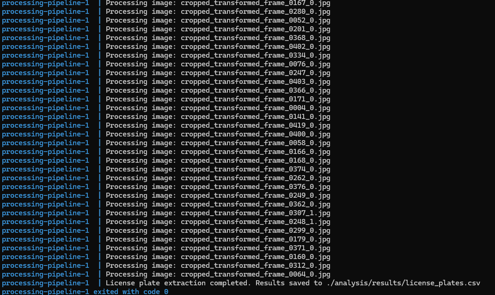
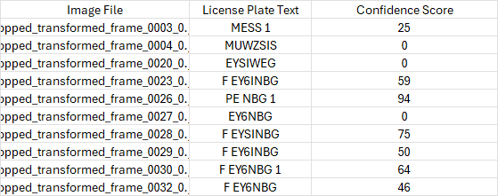

# CASE STUDY: AUTOMATED LICENSE PLATE RECOGNITION
## Project Overview
The Department of Transportation (DoT) has commissioned the development of an Automated License Plate Recognition (ALPR) system to modernize toll collection on its highways. The goal is to improve traffic flow, reduce congestion, and eliminate the need for manual toll collection.

## System Requirements
The ALPR system must be capable of accurately and efficiently recognizing license plates from various states under the following conditions:

- High-speed vehicle movement
- Day and night operations
- Different weather conditions (e.g., rain, snow, fog)

## System Architecture



The ALPR system follows a microservices architecture and is designed to be deployed using Docker containers. The system comprises two main components: the **Processing Pipeline** and the **Video Streamer**. These components are orchestrated and managed using Docker Compose.

#### 1. Video Streamer
The Video Streamer component is responsible for streaming video files or live video feeds over UDP (User Datagram Protocol). It is implemented using FFmpeg, a powerful multimedia framework, and packaged as a Docker container. In a production environment, the Video Streamer component would need to be modified to accept live video streams from IP cameras or other video sources using appropriate protocols (e.g., RTSP) and configurations.

#### 2. Processing Pipeline
The Processing Pipeline is responsible for ingesting video streams, preprocessing frames, detecting and localizing license plates, and performing optical character recognition (OCR) to extract license plate numbers. It consists of the following main components:
- [`main.py`](processing-pipeline/main.py):  coordinates the overall processing pipeline and serves as the entry point for the application.
- [`data_pipeline.py`](processing-pipeline/data_pipeline.py): responsible for extracting frames from video streams and applying transformations to the extracted frames.
- [`dataset.py`](processing-pipeline/dataset.py): handles the loading and splitting of the image dataset for training and evaluation purposes.
- [`metrics.py`](processing-pipeline/metrics.py):  provides functionality for calculating the Intersection over Union (IoU) between two bounding boxes and computing the Average Precision (AP) metric for object detection tasks.
- [`model.py`](processing-pipeline/model.py):  implements an object detection model for license plate detection and utilizes Tesseract OCR to extract the license plate text from the cropped license plate images.

#### 3. Docker Compose
The `docker-compose.yml` file orchestrates and manages the entire ALPR system, defining the services (Video Streamer and Processing Pipeline), networks, volumes, and other configurations required for the application to run seamlessly in a containerized environment.

#### 4. Workflow
The overall workflow of the ALPR system is as follows:
- The Video Streamer streams a video file or live video feed over UDP.
- The Processing Pipeline's Data Pipeline Service ingests the video stream from the Video Streamer and extracts frames.
- The extracted frames undergo transformations in the Data Pipeline Service.
- The Model Service detects and localizes license plates in the transformed frames, generating bounding box predictions.
- The cropped license plate images are passed to the OCR Service for text extraction and confidence score calculation.
- The recognized license plate text and confidence scores are saved in a CSV file.

#### 5. ANALYSIS
[Exploratory Data Analysis](processing-pipeline/analysis/exploratory_data_analysis.ipynb)
 Analyze the images and its features.

 
[Model_Selection Analysis](processing-pipeline/analysis/model_performance.ipnyb)
Analyze the performance of the two provided candidate models

#### 6. Systems Plan
[Systems Plan](SystemsPlan.md)
___
## RUNNING THE ALPR SYSTEM LOCALLY

1. Open a terminal where your video is located and run a server:
```shell
ffmpeg -i LicensePlateReaderSample_4K.mov -vcodec mpeg4 -f mpegts -t 60 udp://127.0.0.1:23000
```


2. Open another terminal where the main.py script is located and run it:
```python
python main.py
```
Note: ffmpeg.exe will run for a set duration (60 seconds) and will terminate before moving on to transformation.





___
## RUNNING THE ALPR SYSTEM USINNG DOCKER

To run the system, make sure you're in the project directory where the `docker-compose.yml` file is located.
```shell
docker-compose build
```
To start up the services: 
```shell
docker-compose up
```




___
## OCR LICENSE PLATE IMAGE TO TEXT RESULTS

### Output Format

Our system processes a series of images to detect and recognize license plates. The results are saved in a CSV file. The CSV file contains three columns:

1. **Image File**: The name of the image file processed. This allows users to trace back the results to the license plate image to review.

2. **License Plate Text**: The text predicted by the OCR as present on the license plate in the image.

3. **Confidence Score**: A numerical value representing the confidence level of the OCR prediction. The confidence score ranges from 0 to 100, where 0 indicates no confidence and 100 indicates full confidence in the prediction.


## Reviewing Results

The CSV file is designed to assist in the manual verification process. Users can cross-reference the image files with the predicted text and use the confidence score to prioritize which results to review first. Typically, lower confidence scores might require more immediate attention, as they indicate less certainty in the OCR's accuracy.

To facilitate this review, one might follow these steps:

1. Open the CSV file in a spreadsheet program like Microsoft Excel or Google Sheets for a user-friendly way to sort and filter the results.

2. Sort the results by the Confidence Score column to review lower-scoring predictions first, as these are more likely to contain inaccuracies.

3. For each entry, locate the corresponding image file to visually confirm the OCR prediction.

4. Make any necessary corrections directly within the spreadsheet or a separate verification system as required by your workflow.

## CSV File Location

The CSV file is saved in the following location within the project directory:

> ./analysis/results/license_plates.csv

## Purpose

The purpose of saving OCR results in this CSV format is to create an efficient, scalable method for verifying and correcting OCR predictions. It streamlines the review process for large batches of images, ultimately enhancing the accuracy of the data captured by the OCR system.
